## 🎶 🎧 music_media
Music Media is an flutter_app integrates with the Deezer API for 
browsing by genre, find artists, playlists and albums, and enjoy 30-second previews of songs.

## ✨ Features

 - 🎼 Genres (Categories): Browse music by categories like Pop, Rock, Hip-Hop, etc.
 - 🎤 Artists: Discover artists, see their top tracks and some other informations.
 - 💿 Albums: Explore albums by genre.
 - 🎵 Tracks: Listen to 30-second previews .
 - 🔍 Search: Find songs, albums,playlists or artists instantly.
 - ⭐ Favorites (with Hive DB): Save tracks,  for quick access.
 - 🎧 Player UI: Minimal music player with track preview and cover art.
 - 🧭 Error Handling
 - 📱 Built for Android & iOS
 - ....and some other amazing features

## Some ScreenShots

  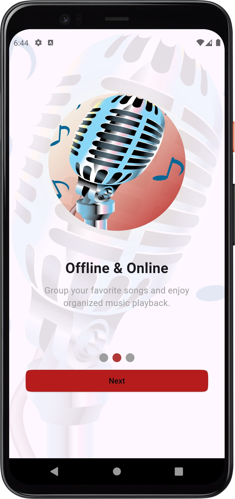
  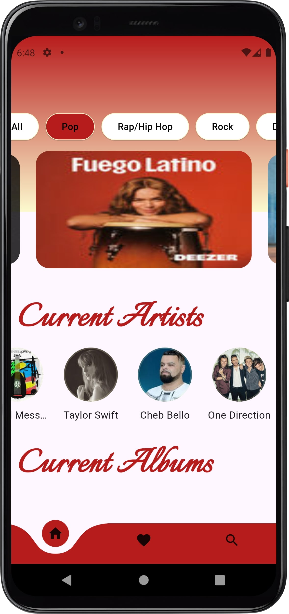
  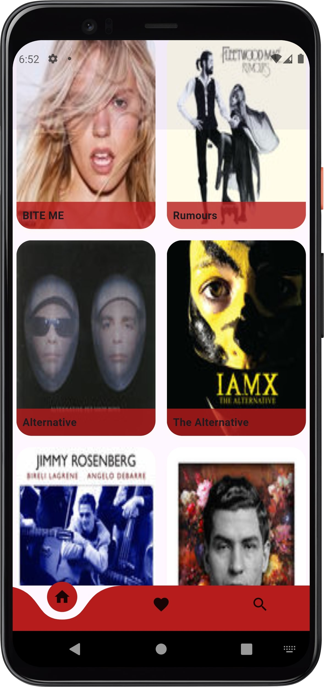

  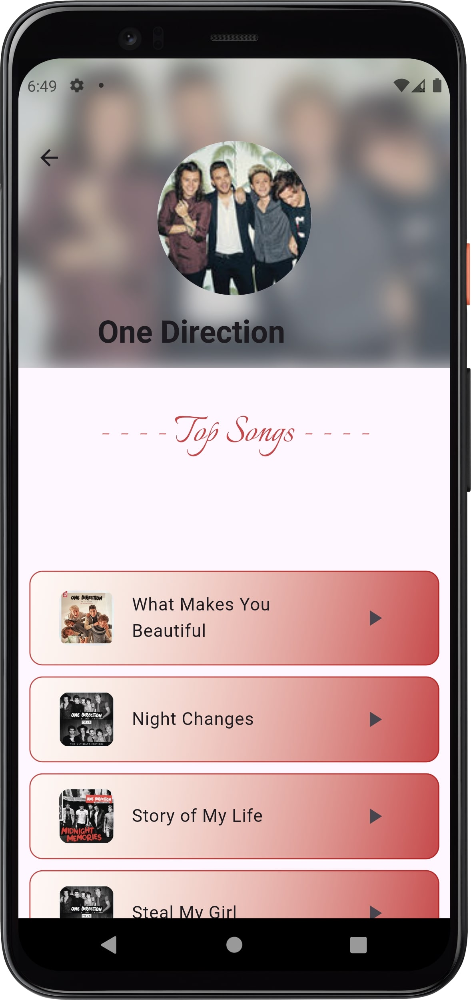
  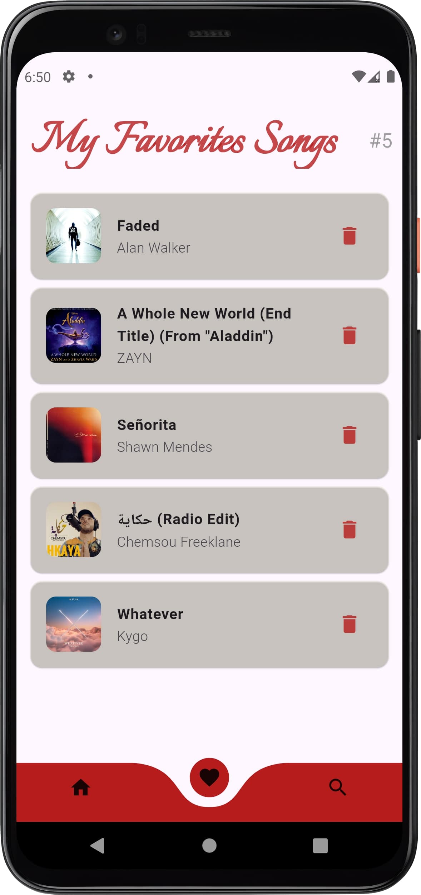
  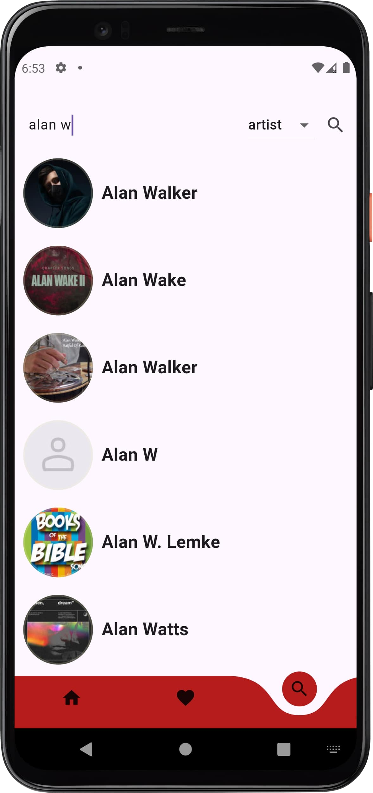

  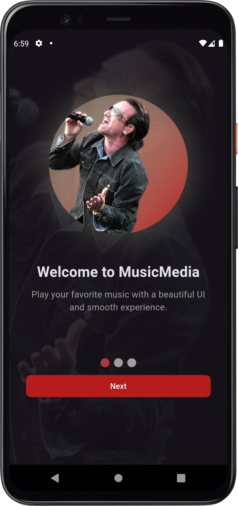
  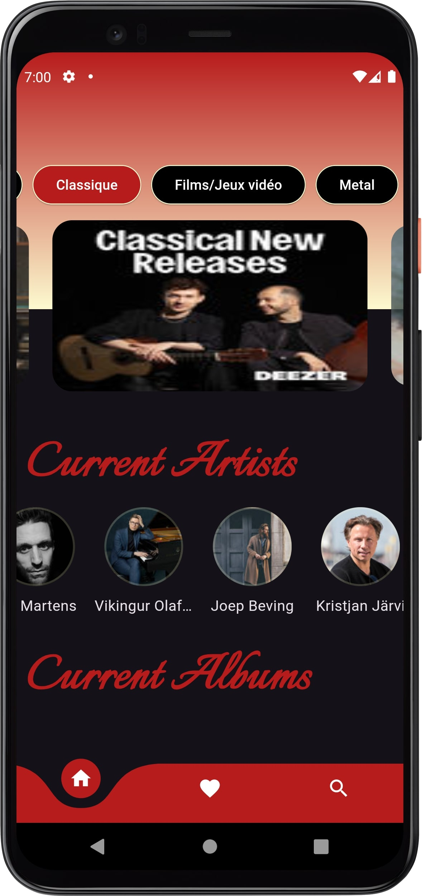
  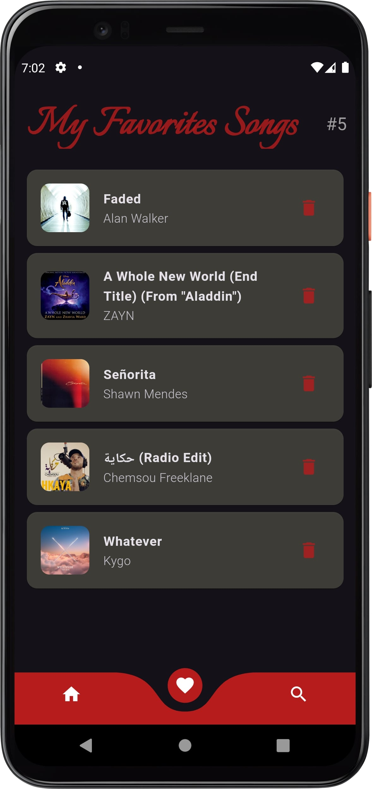

  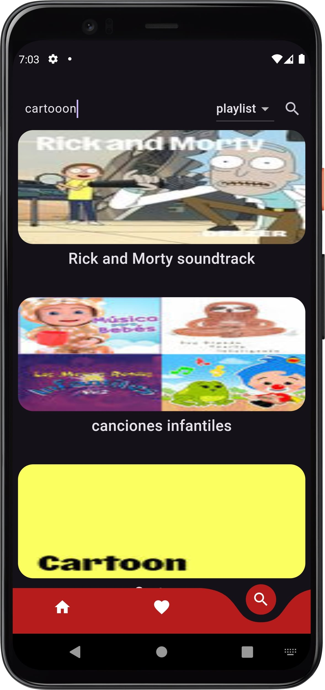
  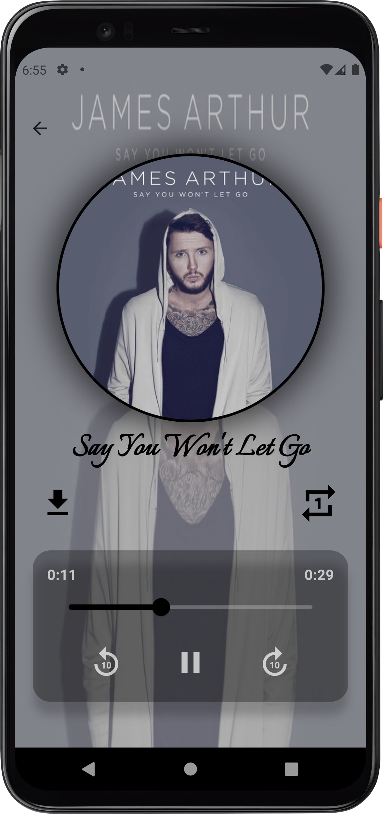

